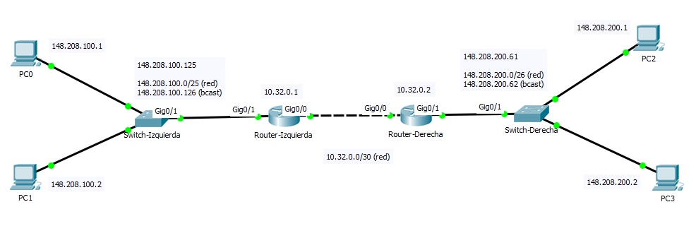

# Subneting
Dividir una red en varias redes

## Máscara de red

Dada cualquier máscara diferente de `8/16/24` obtener el excedente partiendo del octeto anterior `8/16/24`, luego obetener **_n = 8 - excedente_** y elevar **2^_n_**, finalmente a 255 restarle el valor calculado. Ese será nuestro último número de la máscara:

Ejemplo. Para una máscara **30** con un excedente de **6** partiendo de **24**:

- **_n = 8 - 6 = 2_**
- **_x = 2^n = 4_**
- **_256 - x = 252_**
- Mascara de red: `255.255.255.252`

### Octeto

  0  |  0  |  0  |  0  |  0  |  0  |  0  |  0  |
-----|-----|-----|-----|-----|-----|-----|-----|
  8  |  7  |  6  |  5  |  4  |  3  |  2  |  1  |
 128 |  64 |  32 |  16 |  8  |  4  |  2  |  1  |

#### Ejemplos

`10.0.0.0/24` -> `255.255.255.0`

Red ID | Red (bits) | Host (bits) | Ámbito  | Equipos | Redes | Default gateway | Broadcast |
-----------|---|---|--------------------|---------|---------|---|----------------|-----------|
x.x.x.0/19 | 3 | 13 | .1-224.254  | 2^13 - 2 = 8192 | 2^3 = 8 |  ?       |   224.255 |
x.x.x.0/24 | 0 | 8 | .1-.254     | 2^8 - 2 = 254   | 1       |  .254    |   .255    |
x.x.x.0/25 | 1 | 7 | .1-.126     | 2^7 - 2 = 126   | 1       |  .126    |   .128    |
x.x.x.0/26 | 2 | 6 | .1-.62      | 2^6 - 2 = 62    | 1       |  .62     |   .64     |
x.x.x.0/30 | 6 | 2 | .1-.3       | 2^2 - 2 = 2     | 1       |  .2      |   .3      |

`10.0.0.0/30` -> `255.255.255.252`

Red | Host | IP | Pertenece a |
----| ---- | -- | ----------- |
**11111111.11111111.11111111.111111** | **00** | `10.0.0.0` | _red_ 
**11111111.11111111.11111111.111111** | **01** | `10.0.0.1` | equipo 1
**11111111.11111111.11111111.111111** | **10** | `10.0.0.2` | equipo 2
**11111111.11111111.11111111.111111** | **11** | `10.0.0.3` | _broadcast_

## Packet Tracer

#### Configuración básica de un Swich Cisco By LMota

1. Definición del Hostname

        $ hostname <Nombre del Host>

2. Definición de las VLAN

        $ vlan <Vlan-Tag>
        $ name <Descripcion de la VLAN>

3. Asignar Puertos a la VLAN

        $ interface [range] fast 0/<puerto-inicial>-[puerto-final]
        $ switchport mode <trunk/access>
        $ switchport <access/trunk> vlan <Vlan-Tag>
        $ no shutdown  <--- Nunca olvidemos levantar la interfaz

4. Definimos el Gateway por defecto

        $ ip default-gateway <IP router> 

#### Configuración básica de un Router By LMota

1. Definición del Hostname

        $ hostname <Nombre del Host>

2. Definición de las Interfaces
   
        $ interface <Tipo de Interfaz> 0/<puerto>
        $ description <Descripción de la Interfaz>
        $ ip address <Dirección IP> <Mascara> [secondary]
        **** NOTA ****  Si la interfaz usa DHCP deberá escribir ip address dhcp
        $ no shutdown  <--- Nunca olvidemos levantar la interfaz

3. Definición del Ruteo estático

        $ ip route 0.0.0.0 0.0.0.0 <Ip-frontera>      <--- Origen, destino, a quien pregunta
        $ ip route <origen> <mask> <gateway-borde>

#### Comandos utiles

    $ show vlan <-- mostrar configuración de la vlan
    $ no ip address <Dirección IP> <Mascara> [secondary] <---- deshabiltar la dirección ip

#### Configuración de equipos

| Tipo             | Descripcion            | Valor (Ej.)     |
|------------------|------------------------| --------------- |
| IP Address       | Primeras ips de la red | `148.208.100.1`   |
| Subnet Mask      | Mascara de red/subnet  | `255.255.255.128` |
| Deafault Gateway | IP de broadcast        | `148.208.100.126` |

### Ejercicio 4

- Hacer que todos los equipos se comuniquen

